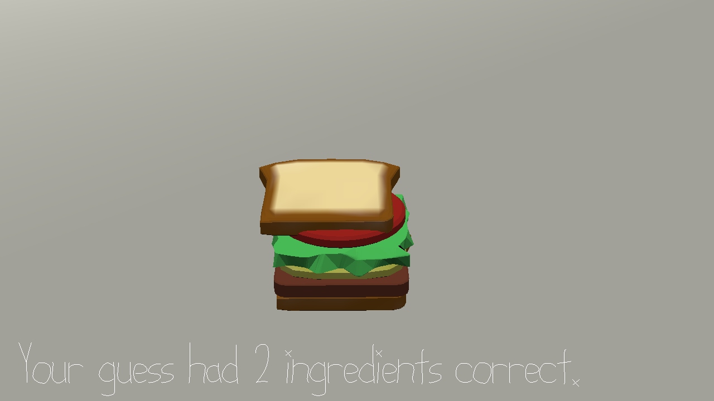

# Sandwich Guesser

Author: David Lyons

Design: This is like those games where you get orders and have to make meals, but instead of being given orders, 
you have to guess the desired recipe. Can you use the clues to figure out the correct sandwich?

Screen Shot:

How To Play:

1 for bread #1. 2 for bread #2. 3 for meat. 4 for cheese. 5 for lettuce. 6 for tomato. The order in which you press the
keys is the order of the ingredients, bottom to top. As you press these buttons, the ingredients will move into that
position. Be patient and wait for the animation to complete. If you try to press the next button while the previous animation
is still happening, it will not register. Text at the bottom will tell you how you did with your guesses. If you got it right,
it will congratulate you. Otherwise, it will tell you how many ingredients you put in the correct place, but not which ones. 
You'll have to be strategic about your guesses to figure out which ones were right. The two slices of bread are interchangeable.
Can you beat your friends and complete the puzzle in less guesses?

[Note for instructors - if you're pressed for time, uncomment line 82 in PlayMode.cpp. This will print the answer to the output
window, allowing you to cheat after a few guesses.]

This game was built with [NEST](NEST.md).
